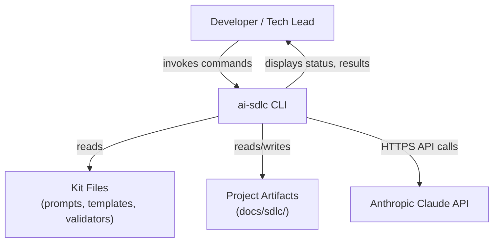
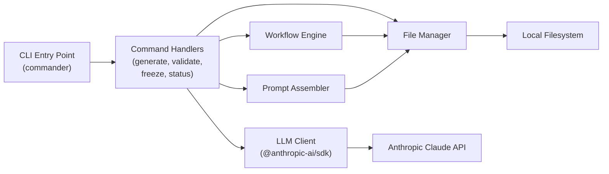
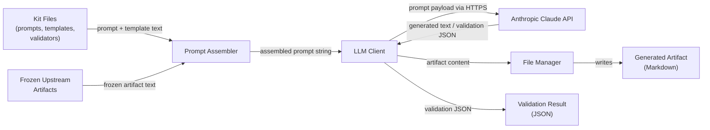

# SAD Template (System Architecture Design)

## 0. Document Control
- System Name: ai-sdlc CLI
- SAD ID: SAD-CLI-001
- Author: AI-generated from PRD-CLI-001 + ACF-CLI-001
- Date: 2026-02-17
- Status: Frozen
- Upstream Artifacts:
  - PRD ID / Link: PRD-CLI-001
  - ACF ID / Link: ACF-CLI-001
- Related ADRs: None

## 1. Intent Summary
- The CLI automates the ai-sdlc-kit playbook workflow, replacing manual prompt assembly, LLM session management, and informal freeze tracking.
- Users are developers and tech leads who understand the playbook but want a tool that handles the mechanics.
- The system covers the full artifact flow: Product Brief → PRD → ACF → SAD → DCF → TDD → WDD → ORD, with validation and freeze at each step.
- Freeze state is enforced — artifacts cannot be generated out of order or without frozen prerequisites.
- The validation loop (FAIL → show issues → regenerate → re-validate) is a core workflow.
- Human approval gates exist: after validator PASS, the user approves before freezing.
- No web UI, GUI, or daemon — CLI only.
- No agent frameworks — thin orchestration over direct LLM API calls.
- No modification to kit prompts, templates, or validators — consume as-is.
- Stateless CLI — all state is files on disk.
- v1 supports Anthropic Claude only; design is provider-swappable.
- No telemetry or data collection.

## 2. Scope and Non-Goals (Hard Boundary)

### In Scope
- Generate artifacts by assembling prompt + template + frozen upstream artifacts into an LLM call
- Validate artifacts by assembling validator + artifact into an LLM call returning structured JSON
- Enforce artifact flow order and prerequisite freeze state
- Track artifact existence and freeze state via files on disk
- Support the validation loop (FAIL → show issues → regenerate)
- Support human approval gates before freezing
- Show workflow status (which artifacts exist, frozen, next step)
- Support execution loop phases (test, plan, code, review) for WDD work items
- CLI invocation pattern: `sdlc <command> <artifact-type>` with commands `generate`, `validate`, `freeze`, `status`

### Explicit Non-Goals
- No web UI or GUI
- No multi-user collaboration features
- No built-in CI/CD integration
- No agent frameworks
- No persistent server or daemon
- No modification to kit files
- No database or external state store

Rule: Anything not listed as in-scope is out of scope by default.

## 3. System Context (Black Box)

### Responsibilities
- Orchestrate the artifact generation and validation workflow
- Enforce artifact flow ordering and freeze prerequisites
- Assemble LLM prompts from kit files and project artifacts
- Write generated artifacts to the project's `docs/sdlc/` directory
- Present validation results and workflow status to the user

### External Actors / Systems
- Upstream: Kit files on disk (prompts, templates, validators from ai-sdlc-kit repository)
- Downstream: Project artifact files on disk (`docs/sdlc/`)
- Users/Clients: Developer or tech lead invoking the CLI from a terminal
- External Service: Anthropic Claude API (LLM provider)

### Trust Boundaries
- Boundary 1: CLI ↔ LLM API — outbound HTTPS calls with API key authentication. The CLI trusts the API response content but must handle errors gracefully.
- Boundary 2: CLI ↔ Local filesystem — the CLI reads kit files and reads/writes project artifacts. File paths are derived from configuration and conventions, not user-supplied arbitrary paths.

### Diagrams

## 4. High-Level Architecture (White Box)

### Major Components

- Name: CLI Entry Point
  - Responsibility: Parse command-line arguments, route to the appropriate command handler.
  - Key interactions: Receives user input, delegates to Command Handlers.

- Name: Command Handlers (generate, validate, freeze, status)
  - Responsibility: Implement the logic for each CLI command. Coordinate between Workflow Engine, Prompt Assembler, LLM Client, and File Manager.
  - Key interactions: Called by CLI Entry Point, uses all other components.

- Name: Workflow Engine
  - Responsibility: Enforce artifact flow order, check prerequisite freeze state, determine next step, manage the validation loop and human approval gates.
  - Key interactions: Queries File Manager for artifact state, gates Command Handlers.

- Name: Prompt Assembler
  - Responsibility: Read the appropriate prompt, template, and upstream artifacts from disk, assemble them into a single prompt string for the LLM.
  - Key interactions: Reads from File Manager, passes assembled prompt to LLM Client.

- Name: LLM Client
  - Responsibility: Send assembled prompts to the LLM API and return responses. Handle API errors (timeouts, rate limits, auth failures).
  - Key interactions: Calls Anthropic Claude API, returns response to Command Handlers.

- Name: File Manager
  - Responsibility: Read kit files and project artifacts from disk. Write generated artifacts to disk. Track artifact existence and freeze state.
  - Key interactions: Reads/writes local filesystem, queried by Workflow Engine and Prompt Assembler.

### Communication Patterns
- Sync vs async: All communication is synchronous. The CLI blocks on LLM API calls and file I/O.
- Protocols (high level): HTTPS for LLM API calls. Local filesystem I/O for all artifact operations.
- High-level data flow: User command → parse args → check prerequisites → assemble prompt → call LLM → write output → display result.

### Diagrams

## 5. Key Architectural Decisions

- Decision: File-based state management (no database)
  - Rationale: The PRD requires stateless CLI with all state as files on disk. Artifacts are Markdown files; freeze state can be tracked via file metadata or content markers.
  - Alternatives considered: SQLite local database, JSON state file separate from artifacts.
  - Consequences: State is human-readable and version-controllable. No migration or schema concerns. Limited to single-user access (which is a non-goal anyway).

- Decision: Provider-swappable LLM interface with Anthropic-only v1 implementation
  - Rationale: The PRD requires provider-swappable design. The ACF constrains v1 to Anthropic Claude only.
  - Alternatives considered: Multi-provider from day one, hard-coded Anthropic-only.
  - Consequences: An interface abstraction exists from the start. Only one implementation ships in v1. Adding providers later requires implementing the interface, not refactoring.

- Decision: Synchronous, blocking execution model
  - Rationale: The CLI processes one command at a time. LLM calls are the bottleneck and inherently sequential per artifact. No concurrency benefit for the user workflow.
  - Alternatives considered: Async/streaming responses.
  - Consequences: Simpler implementation. The user waits for LLM responses. No partial output during generation (unless streaming is added as a future enhancement).

## 6. Cross-Cutting Concerns (Architectural Handling)

### Security
- Authn/authz posture: No application-level authentication or authorization. LLM API authentication via environment variable (`ANTHROPIC_API_KEY`). No secrets in config files or committed files.
- Data protection posture: Artifacts are local Markdown files. No sensitive data handling beyond what the user puts in their project files. HTTPS for all API calls.

### Reliability and Resilience
- Failure isolation strategy: LLM API failures are caught and reported to the user with clear error messages. Failures do not corrupt existing artifact files on disk — new artifacts are written only on successful generation.
- Retry/fallback philosophy: No automatic retries in v1. The user re-runs the command. The validation loop inherently supports retry (regenerate on FAIL).

### Observability
- What must be observable (not how): Command execution status (success/failure), validation results (PASS/FAIL with details), workflow status (which artifacts exist, frozen, next step), LLM API errors.

### Performance and Scale
- Scaling model (high level): Single-user, single-command execution. No scaling concerns beyond LLM API latency.
- Constraints (high level): CLI adds no overhead beyond file I/O. Performance is bounded by LLM API response time.

## 7. Data and Integration

### Data Stores

- Name: Kit Files (read-only)
  - Ownership: ai-sdlc-kit repository
  - Access pattern: Read-only. The CLI reads prompts, templates, and validators from a configurable kit location.

- Name: Project Artifacts (read-write)
  - Ownership: User's project
  - Access pattern: Read existing artifacts (for upstream inputs and state checks). Write new/regenerated artifacts. Read freeze state.

### Integration Patterns
- Pattern 1: File-based input assembly — read multiple files from disk, concatenate into a prompt string.
- Pattern 2: Request-response with LLM API — send assembled prompt, receive generated text or validation JSON.

### State Transitions

Artifact lifecycle states:
1. **Not exists** — artifact file does not exist in `docs/sdlc/`
2. **Draft** — artifact file exists, status is Draft
3. **Validated (PASS)** — artifact has been validated and passed, awaiting human approval
4. **Frozen** — artifact is approved and frozen, available as upstream input for downstream artifacts

Transitions:
- Not exists → Draft: `sdlc generate <type>`
- Draft → Draft: `sdlc generate <type>` (regeneration, overwrites)
- Draft → Validated (PASS): `sdlc validate <type>` returns PASS
- Validated (PASS) → Frozen: `sdlc freeze <type>` (with human approval)
- Validated (FAIL) → Draft: user addresses issues and regenerates

## 8. Failure Modes and Recovery

| Failure Mode | Impact | Detection | Mitigation |
|-------------|--------|-----------|------------|
| LLM API timeout | Generation or validation fails | HTTP timeout error from SDK | Report error to user with clear message. No artifact file written. User re-runs command. |
| LLM API rate limit | Generation or validation fails | 429 response from SDK | Report error to user. No artifact file written. User waits and re-runs. |
| LLM API auth failure | All LLM operations fail | 401 response from SDK | Report error indicating API key issue. Guide user to check `ANTHROPIC_API_KEY`. |
| Kit files not found | Prompt assembly fails | File read error | Report error indicating kit path configuration issue. No LLM call made. |
| Prerequisite not frozen | Generation blocked | Workflow Engine check | Report which prerequisites are missing or not frozen. No LLM call made. |
| Malformed LLM response | Validation returns unparseable result | JSON parse failure on validation response | Report error. User can re-run validation. Existing artifact is not modified. |
| Disk write failure | Generated artifact not saved | File write error | Report error. LLM response is lost; user must regenerate. |

## 9. Quality Attribute Scenarios (QAS)

| Quality Attribute | Scenario | Response | Measure |
|------------------|----------|----------|---------|
| Availability | User runs a CLI command while LLM API is down | CLI detects API error and reports it clearly; no artifact corruption | Error message displayed within seconds of timeout; existing files unchanged |
| Performance | User runs `sdlc generate sad` with frozen PRD and ACF | CLI assembles prompt and calls LLM with no added overhead beyond file I/O | Time from command invocation to LLM call is < 1 second (file I/O only) |
| Security | User's API key is configured via environment variable | CLI reads key from env, passes to SDK, never writes it to disk or logs | No secrets appear in config files, artifacts, or CLI output |
| Usability | User runs `sdlc status` to check workflow progress | CLI displays which artifacts exist, which are frozen, and what step is next | Output is accurate and reflects current file state on disk |
| Reliability | LLM returns a malformed response during validation | CLI catches parse error, reports it, does not modify existing artifacts | Error reported; no data loss; user can retry |

## 10. Constraints and Guardrails (from ACF)
- Guardrail 1: TypeScript (strict mode) with ESM only — no CommonJS.
- Guardrail 2: Runtime dependencies limited to `@anthropic-ai/sdk` and `commander` only.
- Guardrail 3: No agent frameworks (LangGraph, AutoGen, CrewAI, or similar).
- Guardrail 4: No persistent server, daemon, or background process.
- Guardrail 5: No database or external state store — state is files on disk only.
- Guardrail 6: No web UI, GUI, or browser-based interface.
- Guardrail 7: No modification to kit prompts, templates, or validators.
- Guardrail 8: No secrets in config files or committed files. API keys from environment variables only.
- Guardrail 9: No telemetry or data collection.
- Guardrail 10: v1 supports Anthropic Claude only. Provider-swappable design for future additions.

## 11. Deferred Decisions (Explicit)
- Deferred 1: Freeze state tracking mechanism — whether freeze is indicated by a status field in the artifact Markdown, a separate state file, or file naming convention. Reason: multiple valid approaches exist; the choice affects File Manager internals but not the overall architecture. Deferred to TDD.
- Deferred 2: Configuration file format and location (`.sdlcrc.json` or alternative). Reason: a detail-level decision that does not affect component boundaries or data flows. Deferred to TDD.
- Deferred 3: LLM provider interface contract (exact method signatures, configuration shape). Reason: the SAD establishes the provider-swappable pattern; the specific interface shape is a technical design concern. Deferred to TDD.
- Deferred 4: Execution loop implementation details (how test/plan/code/review phases are invoked and tracked). Reason: the SAD establishes that the CLI supports execution loop phases; the specific commands and state tracking are detail-level design. Deferred to TDD.
- Deferred 5: Streaming vs. buffered LLM responses. Reason: does not affect component boundaries; either approach works within the synchronous execution model. Deferred to TDD.
- Deferred 6: Error message formatting and verbosity levels. Reason: a UX detail that does not affect architectural structure. Deferred to TDD.

## 12. Risks and Assumptions

### Risks
- Risk 1: LLM output quality varies — generated artifacts may not pass validation on first attempt. Mitigation: the validation loop is a core workflow feature.
- Risk 2: Large upstream artifacts may exceed LLM context windows. Mitigation: kit artifacts are designed to be concise. The CLI can warn if input exceeds a token threshold.
- Risk 3: LLM response format for validation may not be reliably parseable as JSON. Mitigation: structured output prompting; fallback error handling if parse fails.

### Assumptions
- Assumption 1: The user has a working Anthropic API key configured in their environment.
- Assumption 2: The ai-sdlc-kit files are accessible on disk at a known/configured path.
- Assumption 3: The project follows the `docs/sdlc/` convention for artifact storage.
- Assumption 4: The Anthropic SDK handles HTTPS, retries, and connection management.

## 13. Readiness Checklist (Self-Check)
- [x] Intent Summary pasted and unchanged
- [x] Scope and non-goals explicit
- [x] Boundaries and major components clear
- [x] C4 Context (L1) diagram present
- [x] C4 Container (L2) diagram present
- [x] Data Flow diagram present
- [x] Data stores and integrations documented
- [x] Failure modes table complete
- [x] At least one QAS per quality attribute
- [x] Decisions resolved or explicitly deferred
- [x] No implementation details (build steps, configs, pipelines)

## 14. Freeze Declaration (when ready)
This SAD is approved and frozen. Downstream artifacts may not reinterpret or expand this architecture.

- Approved By: Project Maintainer
- Date: 2026-02-17
