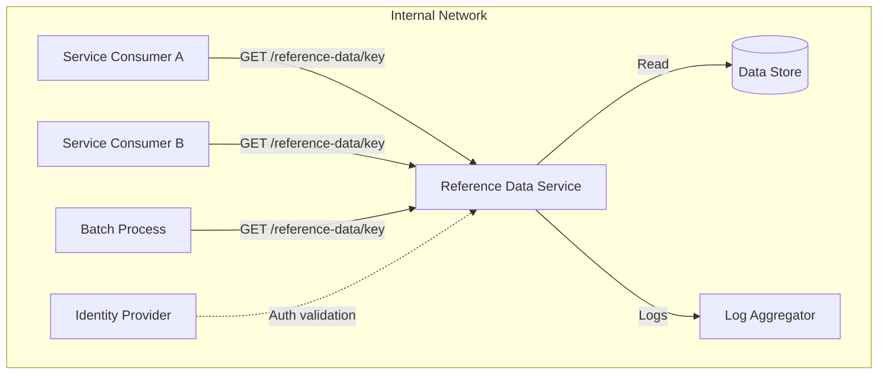

# SAD — Reference Data Service

## 0. Document Control
- System Name: Reference Data Service
- SAD ID: SAD-EX-001
- Author: Example Team
- Date: 2025-01-20
- Status: Frozen
- Upstream Artifacts:
  - PRD: PRD-EX-001
  - ACF: ACF-EX-001
- Related ADRs: None

## 1. Intent Summary
(Paste of approved intent summary — see `03-intent-summary.md`)

- Provide read-only access to reference data via a single internal API
- Serve internal service consumers and automated batch processes only
- No UI, no data mutation, no external exposure
- Must follow standard platform guardrails (ACF-EX-001)
- Architecture should be simple: stateless API backed by a data store
- Must support rollback, structured logging, and health checks
- Reference data volume is modest; eventual consistency is acceptable
- Service-to-service authentication required for all consumers

## 2. Scope and Non-Goals (Hard Boundary)

### In Scope
- Read-only API for retrieving reference data by key
- Internal consumption only
- Structured logging and health check endpoint
- Service-to-service authentication

### Explicit Non-Goals
- Data mutation or write operations
- User interface of any kind
- External network exposure
- Data ingestion or pipeline management
- Caching beyond platform defaults

## 3. System Context (Black Box)

### Responsibilities
The Reference Data Service is responsible for serving reference data to internal consumers via a read-only API.

### External Actors / Systems
- Internal service consumers: Send authenticated GET requests to retrieve reference data
- Automated batch processes: Query reference data on a scheduled basis
- Platform identity provider: Validates service credentials
- Central log aggregator: Receives structured logs

### Trust Boundaries
- All inbound traffic is internal-only (no public ingress)
- All consumers must present valid service credentials
- The service trusts the platform identity provider for authentication

## 4. High-Level Architecture (White Box)

### Major Components
- **API Component**: Handles HTTP requests, authentication validation, request routing, and error responses
- **Data Access Component**: Reads from the backing data store, maps data to the response schema

### Communication Patterns
- Synchronous request/response over HTTP between consumers and API
- Synchronous read from data store by data access component
- Asynchronous log forwarding to central aggregator

## 5. Key Architectural Decisions

| Decision | Rationale | ADR |
|----------|-----------|-----|
| Use synchronous request/response model | Simplest pattern for read-only lookups; aligns with approved patterns in ACF-EX-001 | N/A |
| Centralize data access behind API | Prevents direct database access by consumers; enforces forbidden pattern from ACF-EX-001 | N/A |
| Stateless service design | Enables simple rollback and horizontal scaling if needed | N/A |

## 6. Cross-Cutting Concerns (Architectural Handling)

### Security
- Service-to-service authentication enforced at the API component level
- TLS required for all communication (per ACF-EX-001)
- No secrets stored in application code; injected via platform secrets manager

### Reliability / Resilience
- Service is stateless; any instance can serve any request
- Failed deployments are rolled back to the previous container image
- Data store unavailability returns a clear error response; does not crash the service

### Observability
- Structured JSON logs emitted for every request (method, path, status, latency)
- Health check endpoint at `/health`
- Request count, error rate, and latency percentiles exposed as metrics

### Performance / Scale
- Reference data volume is modest; no caching layer required
- Stateless design allows horizontal scaling if demand increases
- Single data store read per request; no fan-out

## 7. Constraints and Guardrails (from ACF)
- ACF-EX-001 constraints apply in full
- No public ingress
- Service-to-service authentication required
- Rollback must be supported
- Direct database access by consumers is forbidden
- Structured logs and health check are mandatory

## 8. Deferred Decisions (Explicit)

| Decision | Reason | Target Resolution Phase |
|----------|--------|------------------------|
| Storage technology selection | Not an architectural concern; any read-capable store suffices | TDD |
| Specific metrics tooling | Platform-dependent; not an architectural constraint | TDD |

## 9. Risks and Assumptions

| Risk | Impact | Mitigation |
|------|--------|------------|
| Data store becomes unavailable | Consumers receive errors | Service returns graceful error; consumers expected to handle failures |
| Reference data grows beyond modest volume | Latency increases | Stateless design supports scaling; caching can be added as a future enhancement |

### Assumptions
- Reference data volume remains modest for the foreseeable future
- Platform identity provider is reliable and available
- Central log aggregator is operational

## 10. Readiness Checklist (Self-Check)
- [x] Intent summary matches PRD
- [x] Non-goals are explicit
- [x] ACF guardrails are addressed
- [x] System boundary is clear
- [x] Major components are identified
- [x] Architectural decisions are documented
- [x] Cross-cutting concerns are covered
- [x] Deferred decisions are explicit
- [x] No implementation details present

## 11. Freeze Declaration
This SAD is approved and frozen. TDD work may proceed.

- Approved By: Example Team
- Date: 2025-01-20
